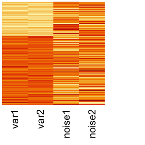
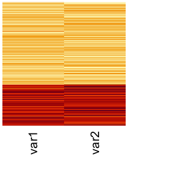

MKKC Package
================

Overview
========

The **MKKC** package performs multiple kernel *k*-means clustering on a multi-view data. The method is suggested by suggested by Bang and Wu (2018). The main function-`mkkc` efficiently and robustly utilizes complementary information collected from different sources and optimizes the kernel coefficients for different views in multiple kernel learning. This package also includes 18 multi-view simulation data generated for illustration purpose. We will give a short tutorial on using **MKKC** on the simulation data and assess how robustly it performs when noise and redundancy are present in the multi-view data.

Installation
============

Users can install the package from [github](https://github.com/SeojinBang) as follows:

``` r
install.packages("devtools")
devtools::install_github("SeojinBang/MKKC")
```

A recent version of *Rmosek* (&gt;= 8.0.46) is also required. See the [Rmosek installation instructions](http://docs.mosek.com/8.0/rmosek/install.html) for details on installing for your platform.

Usage
=====

`mkkc` performs the multiple kernel K-means clustering on multi-view data. The usage is

``` r
mkkc(K, centers, iter.max, A, bc, epsilon)
```

where

-   `K` is *N* × *N* × *P* array containing *P* kernel matrices with size *N* × *N*.
-   `centers` is the number of clusters, say *k*.
-   `iter.max` is the maximum number of iterations allowed. The default is 10.
-   `A` is *m* × *P* linear constraint matrix where P is the number of views and m is the number of constrints.
-   `bc` is 2 × *m* numeric matrix with the two rows representing the lower and upper constraint bounds.
-   `epsilon` is a onvergence threshold. The default is 10<sup>−4</sup>.

If there is no prior information to indicate relative importance of the views, one can perform the clustering analysis using the most basic call to `mkkc` without specifying `A` and `bc`:

``` r
mkkc(K, centers)
```

The function `mkkc` returns an object of class `MultipleKernelKmeans` which has `print` and `coef` method. The output includes a vector of clustering labels to which each point is allocated (`$cluster`) and kernel coefficients (`$coefficients`). See the documentation page of `mkkc` for detail:

``` r
??mkkc
help(mkkc, package = "MKKC")
```

Simulation Data
===============

The object `multiviews` contains multi-view simulation data used in Bang et. al (2018), which aims to access how robustly `mkkc` performs a clustering when noise or redundant information are present in multi-view data. The simulation data sets are composed of multiple views generated from three clusters with 100 samples for each the cluster. The data sets also include the true label which is a factor-type vector with three levels (100 cases for each).

See the documentation page of `multiviews` for details:

``` r
??multiviews
help(multiviews, package = "MKKC")
```

Example
=======

In this tutorial, we will describe how to use `mkkc` to cluster multi-view data using a simulation data set created beforehand. In particular, we will examine how robustly `mkkc` concatenates multiple views when noise is present in the multi-view data. Users can either use their own data or use any of the simulated data saved in the workplace.

We first load the **MKKC** package:

``` r
library(MKKC)
```

In this example, we use a simulation data set `simBnoise` which is composed of two partial views. Each partial view only conveys partial information so that each view alone cannot completely detect the three clusters. The first view (View 1) is able to detect the first cluster but not able to identify the difference between the second and third cluster. The second view (View 2) is able to detect the third cluster but cannot identify the difference between the first and second cluster. Additionally, View 1 has 10 noise variables that have no information about the clusters, while we will use only 3 noise variables added to View 1.

``` r
truelabel <- simBnoise$true.label
n.noise <- 3                                    # number of noises to be added
dat1 <- simBnoise$view1[,c(1:(2 + n.noise))]    # view 1
dat2 <- simBnoise$view2                         # view 2
```

We can visualize the multi-view data using heatmap:

``` r
heatmap(dat1, scale = "column", Rowv = NA, Colv = NA, labRow = NA, cexCol = 1.5)    # view 1
heatmap(dat2, scale = "column", Rowv = NA, Colv = NA, labRow = NA, cexCol = 1.5)    # view 2
```



Construct Kernel Matrices
-------------------------

The function `mkkc` takes a kernel matrix for each view as an input. In this tutorial, we use a RBF kernel for all the views, while users can use any view-specific kernel functions. We use a package `kernlab` to define the RBF kernel and calculate kernel matrice from the views.

``` r
require(kernlab)

rbf <- rbfdot(sigma = 0.5)        # define a RBF kernel
dat1 <- kernelMatrix(rbf, dat1)   # kernel matrix from View 1
dat2 <- kernelMatrix(rbf, dat2)   # kernel matrix from View 2
```

Construct Multi-view Data
-------------------------

Centering and scaling of kernel matrices in multi-view learning allow multiple views comparable with each other. Hence, we recommand to standardize the kernel matrices before combining them. Each kernel matrix is centered by **K** ← **K** – **J**<sub>*n*</sub>**K** – **K****J**<sub>*n*</sub> + **J**<sub>*n*</sub>**K****J**<sub>*n*</sub> and scaled by **K** ← *n***K**/*t**r*(**K**) where **J**<sub>*n*</sub> = **1**<sub>*n*</sub>**1**<sub>*n*</sub><sup>*T*</sup>/*n* and *n* is the number of samples.

We standardize the kernel matrices using a function `StandardizeKernel` provided by **MKKC**. With the standarized kernel matrices, we construct a multi-view data as a 300 × 300 × 2 array.

``` r
n.view = 2    # the number of views used
K = array(NA, dim = c(nrow(dat1), ncol(dat1), n.view))
K[,,1] = StandardizeKernel(dat1, center = TRUE, scale = TRUE)
K[,,2] = StandardizeKernel(dat2, center = TRUE, scale = TRUE)
```

Multiple Kernel k-Means Clustering
----------------------------------

We perform the clustering using the most basic call to `mkkc`. It requires a multi-view data set `K` and the number of clusters `centers`. We run the clustering using the multi-view simulation data constructed above and set `centers = 3`.

``` r
res <- mkkc(K = K, centers = 3)
```

`res` is an object of class `MultipleKernelKmeans` which has a `print` and a `coef` method. We can obtain a vector of clustering labels by `res$cluster` and kernel coefficients of the two views by `coef(res)`.

A comprehensive summary of the clustering is displayed with use of the print function:

``` r
print(res)
```

    ## 
    ## Multiple kernel K-means clustering with 3 clusters of sizes  104, 96, 100 
    ## 
    ## Kernel coefficients of views:
    ## [1] 0.9342697 0.3565671
    ## 
    ## Clustering vector:
    ##   [1] 3 3 3 3 3 3 3 3 3 3 3 3 3 3 3 3 3 3 3 3 3 3 3 3 3 3 3 3 3 3 3 3 3 3 3
    ##  [36] 3 3 3 3 3 3 3 3 3 3 3 3 3 3 3 3 3 3 3 3 3 3 3 3 3 3 3 3 3 3 3 3 3 3 3
    ##  [71] 3 3 3 3 3 3 3 3 3 3 3 3 3 3 3 3 3 3 3 3 3 3 3 3 3 3 3 3 3 3 1 1 1 1 1
    ## [106] 1 2 2 1 1 1 1 1 1 1 1 1 1 1 1 1 1 1 1 1 1 1 1 1 1 1 1 1 1 1 1 1 1 1 1
    ## [141] 1 1 1 1 1 1 1 2 1 1 1 1 1 1 1 1 1 1 1 1 1 1 1 1 1 1 1 1 1 1 2 1 2 1 1
    ## [176] 1 1 1 1 1 1 1 1 1 1 1 1 1 1 1 1 1 2 1 1 1 1 1 1 1 2 2 2 2 2 2 2 2 2 2
    ## [211] 2 2 2 2 1 2 2 2 2 2 1 2 2 1 2 2 2 2 2 2 2 2 2 2 1 2 2 1 2 2 2 2 2 2 2
    ## [246] 2 2 2 2 2 2 2 2 2 2 2 2 1 2 2 2 2 1 2 2 2 2 2 2 2 1 1 2 1 2 2 2 2 2 2
    ## [281] 2 2 2 2 2 2 2 2 2 2 2 2 2 2 2 2 2 2 2 2
    ## 
    ## Within cluster sum of squares by cluster:
    ##  cluster1  cluster2  cluster3 
    ## 0.3437935 0.3158945 0.3279382 
    ## (between_SS / total_SS =   23.5  %)
    ## 
    ## Within cluster sum of squares by cluster for each view:
    ##        cluster1  cluster2  cluster3
    ## view1 0.3291147 0.2917875 0.3068691
    ## view2 0.1018366 0.1213974 0.1156576
    ## 
    ## Available components:
    ##  [1] "cluster"         "totss"           "withinss"       
    ##  [4] "withinsscluster" "withinssview"    "tot.withinss"   
    ##  [7] "betweenssview"   "tot.betweenss"   "clustercount"   
    ## [10] "coefficients"    "size"            "iter"           
    ## [13] "call"

It displays kernel coefficients, clustering vector (clustering label assigned to the samples), within cluster sum of squares by cluster, and within cluster sum of squares by cluster for each view.

License
=======

The **MKKC** package is licensed under the GPL-3 (<http://www.gnu.org/licenses/gpl.html>).

References
==========

Bang, Seo-Jin, and Wei Wu. 2018. “Multiple Kernel K-Means Clustering Using Min-Max Optimization with L2 Regularization.” *Submitted to Intelligent Systems for Molecular Biology (ISMB) 2018*.
